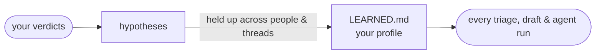
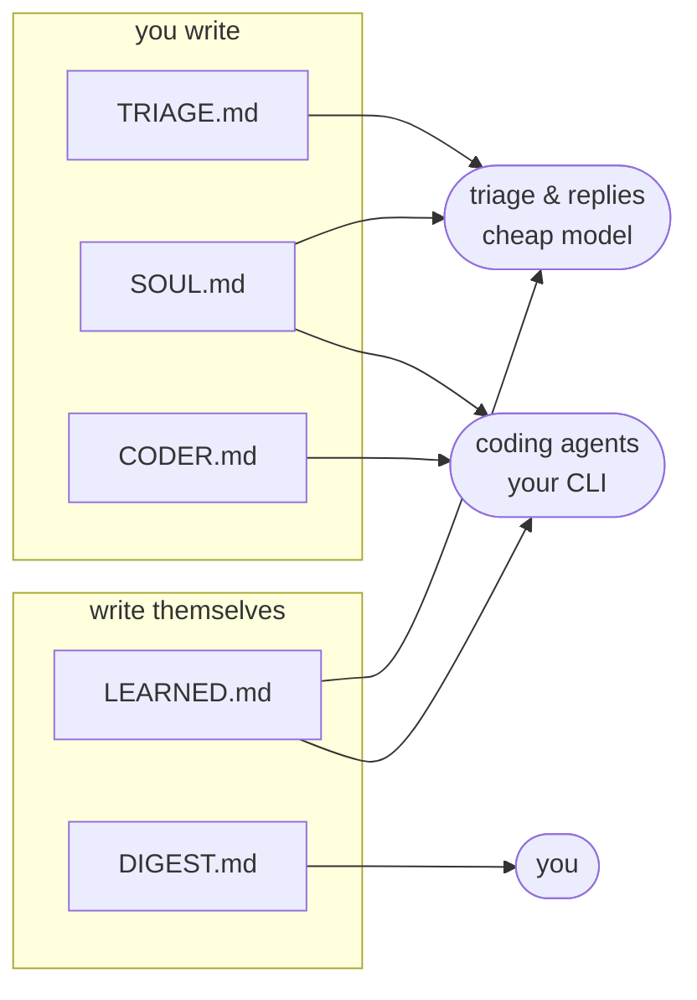

# Taskuary

[](https://github.com/ldbumble/taskuary/actions/workflows/ci.yml)
[](LICENSE)
[](https://github.com/ldbumble/taskuary)
[](CONTRIBUTING.md)

## Automate your job.

**Your inbox and your coding agents in one place.** Email, Teams, Slack, GitHub issues and
scheduled reports land on one timeline; AI triage says what is real work; the coding CLI
you already use does it; you approve the result. Runs entirely on your machine.


## Why

Work arrives as messages, but work *is* tasks — and you are the translation layer. You
read the mail, decide what it means, open the ticket, do the thing, and write back. The
first and last steps are where the day goes.

Taskuary automates the ends and leaves you the middle. Triage reads everything and files
the noise. Real work becomes a task and goes to your agent, which works in your repos and
reports back with the diff. Replies come back as drafts. Nothing sends, closes, or ships
without you — and nothing leaves your machine except the calls you configured.

## It learns your job

Every verdict you give teaches it. Edit a draft before sending — it learns your voice.
Reject one — it learns what should never have been drafted. Say **"Not our task"** — it
learns where your job ends, and that one sticks immediately as a standing note on that
sender (yours to review under Settings → Agent memory).

The general lessons take a stricter road, so one odd Tuesday never becomes a rule:



Three rules keep it honest: every learned line carries its evidence (`[s:4 | ev: rv12…]` —
delete the line and the lesson is gone), a pattern seen once is never acted on, and a rule
that would *hide* mail waits for your explicit OK. `SOUL.md` — the rules you write yourself —
always outranks what's learned, and one switch in Settings turns the loop off.

## Get started

```bash
pip install git+https://github.com/ldbumble/taskuary
taskuary        # opens http://127.0.0.1:7787
```

Python 3.10+ is all you need. Then, in **Connectors** — a minute or two each:

1. **AI** — paste an Anthropic / OpenAI / Azure OpenAI / OpenRouter key — or no key at
   all: the **Ollama** card runs triage on a local open-source model. Triage is now on.
   (A small, cheap model is the right pick here; the expensive one goes in step 3.)
2. **A channel** — Outlook, Teams, or Slack. Mail starts landing on the Timeline.
3. **Your coding CLI** — pick a preset (Claude Code, Codex, Gemini, Cursor, Copilot), Save,
   Test. Add a GitHub PAT and repos are discovered for you.
4. **Reports** (optional) — point at SQL Server / MCP / SQLite / REST / RSS and schedule a
   query with an AI prompt; the summary lands on your Timeline.

No cloud key at all? Set **Settings → Triage & routing → Triage brain** to your CLI agent
and skip step 1 — one brain does everything, slower and pricier per message. See
[One brain or two](#one-brain-or-two).

Prefer a desktop app? `pip install "taskuary[desktop] @ git+https://github.com/ldbumble/taskuary"`
then `taskuary-desktop` — the same UI in a native window. A prebuilt single-file
`Taskuary.exe` is attached to every CI run.

## The workspace

One tab per question, two lines each; the details live in the app's own help text.

- **Timeline** — everything inbound on one day-grouped rail, chips saying what each row IS
  and whether it needs you. Click a row: the whole message (stored whole, not a preview),
  its attachments drawn inline — half of "see below" mail is the screenshot — and every way
  out: approve the drafted reply, send it to a coding agent, hand it to a person, split or
  merge, "not our task" (which teaches triage for next time).
- **Board** — the agent kanban: Queued / Working / Waiting on you / Done, by what is TRUE
  right now — a live session counts as working, and a session gone quiet moves its card to
  *waiting on you* with the question showing. Cards working now show a live peephole.
- **Tasks** — **the page is a terminal**: your CLI in the task's repo, prompt typed in and
  sent, and you keep talking. Taskuary picks the checkout from the SOUL.md repo map (one
  click to override); the prompt carries the ask, the mail, the files and the rules, so the
  agent never re-fetches what it was handed. **Done — wrap it up** reads the transcript,
  writes the report and drafts the reply — the agent is asked nothing, and both still work
  after the terminal itself is long gone. Pause keeps a handover note the next session is
  seeded with. The kind is a control: *"this is not a coding task"* is one dropdown, and
  saying `reply` routes it into Review instead of a repo.
- **Review** — the decision queue. **Approve & send** sends whatever is in the box on the
  channel it arrived on, in-thread; a refused send says so right there and keeps the text.
  A reply drafted before an agent looked at the problem waits as *held* and comes back
  rewritten from what the agent actually found.
- **Reports** — sources at the top (SQL, REST, MCP…), one AI prompt at the bottom, a
  schedule. The rows come back as an **.xlsx** and a **bar chart** the summarizing model
  itself chose the columns for; capped slices are named as capped so the AI never calls a
  truncated slice "all of them". Preview runs the whole pipeline first.
- **Connectors** — a catalog with a wizard per card. Every connection has **roles** you
  choose: *trigger* (inbound work), *feed* (shown, never triaged), *report*, *tool* (agents
  may use it), *notify* (Taskuary pushes pings TO it). Nothing is polled without a role.
- **Docs** — the five plain-markdown documents that steer everything (see
  [The five documents](#the-five-documents)); they maintain themselves as connectors and
  repos appear. Your name lives in ONE field here and fills every `{{owner}}` mention.
- **Settings** — triage knobs with plain-English help, deterministic routing policies that
  no model confidence can override, the learned memory, notification level, and one-click
  audit-chain verification.

Two principles hold everywhere: **nothing sends or ships without your approval**, and
**agents work where you can watch** — a real terminal, never a hidden run. Out of the box
it works the mail (auto-dispatch + auto-draft, both switchable); triage is AI-gated, so
with no AI connected messages file visibly instead of heuristics spraying tasks.

## Telegram & WhatsApp — the funnel in your pocket


*The phone's side of it (the message text is exactly what Taskuary sends). What the same moment
looks like inside the app: [the timeline view](docs/screenshot-messengers.png).*

The personal messengers work both directions, and each direction is a role you switch on:

- **In (trigger)** — message your Telegram bot, or anyone messages your WhatsApp, and it
  lands on the Timeline through the same triage as mail: a question gets a drafted reply
  (unsigned and short, because it is chat), a job becomes a task, a photo of the broken thing
  reaches the vision triage and draws in the panel. Approving sends the answer back **into the
  same chat**. Telegram is built in — a @BotFather token and nothing else. WhatsApp runs
  through a small bridge beside the app (`cd taskuary/whatsapp && npm install && node
  bridge.mjs`, pair once by QR or phone code) so the heavy unofficial-protocol dependency
  never enters Taskuary itself.
- **Out (notify)** — the Timeline pushed to you, instead of you polling the tab. Give the
  connector the *notify* role, name the chat in its config, and Taskuary pings it: by default
  (*needs_me*) only what is actually waiting on you — a question to answer, a task nobody was
  dispatched at, and the one that matters most, *"the work is done, the reply is drafted and
  waiting in Review"*. Set the level to *all* for every new item, *off* for silence. Events
  that happened in the notify chat itself are never echoed back into it.

One channel can wear both roles at once: ask for something from your phone, an agent works
it, and the "done — approve the reply" ping arrives back on the same phone.

## One brain or two

Two different jobs, two very different price tags: **triage** reads one message and answers
in a line (thousands of times a month), **coding** rewrites your repositories (a few times a
day). Taskuary lets you split them or tier them:

| setup | triage / drafts / summaries | coding sessions | when |
|---|---|---|---|
| **Two brains** (recommended) | a small cloud model — Anthropic / OpenAI / Azure OpenAI / OpenRouter connector, fractions of a cent per message | your CLI agent, its full model | you have (or can get) one cheap API key |
| **One brain, two gears** | the same CLI, downshifted to its **light model** (set it on the agent: `haiku`, `gemini-2.5-flash`…) | the same CLI, its main model | one subscription, no API key — Claude Max, Codex |
| **One brain, one gear** | the CLI at full model | the CLI at full model | works, but every newsletter costs a frontier-model run |
| **Local brain** | an open-source model on your own machine — the Ollama connector, or any OpenAI-compatible server (LM Studio, llama.cpp, vLLM) | your CLI agent, or a CLI wrapping the same local model | no key, no cloud, no mail leaving the box |

Suggested setup: connect an **Anthropic** key with `claude-haiku-4-5` as the triage brain
(Settings → Triage & routing), keep `claude` as the coder with its default model — or, with
no API key at all, set the coder's **light model** to `haiku` (Connectors → AI CLI agents →
Edit) and point the triage brain at `cli: coder`. Either way the expensive model only ever
runs when there is real work in a real repository, and the cheap one handles the reading:
intent triage, reply drafts, report summaries, the morning digest, the lessons distilled
into LEARNED.md.

## The five documents

Plain markdown, all on the Docs tab, all yours to edit. Three you write, two write
themselves — and each feeds exactly the calls it belongs in.



| document | what it is | who reads it |
|---|---|---|
| `TRIAGE.md` | the classifier's instructions — what makes a task, a question, or FYI; ships as a default, edit it to reshape every verdict | triage (cheap model) |
| `SOUL.md` | the constitution: your rules, voice, escalation lines, the repo map | triage, replies, coding agents |
| `CODER.md` | how the coding agent works and closes out | coding agents (your CLI) |
| `LEARNED.md` | your profile, learned from your verdicts — `SOUL.md` outranks it | triage, replies, coding agents |
| `DIGEST.md` | your morning brief: what's in flight, who waits on whom, rebuilt daily | you |

Standing notes (Settings → Agent memory) ride alongside: sender-scoped verdicts injected
into triage and replies — the specific layer under `LEARNED.md`'s general one.

## Bring your own agent — and pick its model

Every run surface (Board dialog, task page, "send to coding agent") asks two questions:
**which CLI** works it, and **which model** that CLI runs. The model list comes from the
CLI — `opus` / `sonnet` / `haiku` and the full `claude-*` ids for Claude Code, the
`gpt-5-codex` family for Codex, and so on — and "the agent's default model" leaves it to
the profile. Under the hood it is one flag appended to the command (`--model` by default,
`model_arg` if your CLI spells it differently), so a per-run choice never edits your saved
profile.

Any CLI that reads a prompt on stdin works. The presets ship the right headless flags —
the important one being the auto-approve flag (`--dangerously-skip-permissions`,
`--full-auto`, `--yolo`, …): without it a headless agent hangs waiting for an approval
click that never comes. The built-in **Test** runs one tiny prompt through your CLI to
prove the wiring before it goes live. Claude Code's JSON output is parsed natively,
which enables resumable message-the-agent sessions; plain-text CLIs work too.

## Integrations

| type | status | notes |
|------|--------|-------|
| `outlook` / `teams` / `slack` | ✅ | inbound channels → Timeline through AI triage |
| `gmail` / `imap` | ✅ | any mailbox that speaks IMAP — Gmail (App Password), a domain.com address, Yahoo, an ISP. In through triage, approved replies back over the provider's own SMTP, in-thread |
| `telegram` | ✅ | a bot token from @BotFather and nothing else — chats in through triage, approved replies back into the chat, photos reach the vision triage |
| `whatsapp` | ✅ | your own account, via a small Baileys bridge that runs beside the app (`cd taskuary/whatsapp && npm install && node bridge.mjs`, pair once by QR or code). The heavy dependency deliberately lives there, not in Taskuary — unofficial protocol, use a number you'd risk |
| `github` | ✅ | PAT → auto repo discovery, issue loop, repo map in SOUL.md; optional inbound trigger (new issues → Timeline → triage) |
| `anthropic` / `openai` / `azure_openai` | ✅ | AI for triage + report summaries |
| `openrouter` | ✅ | one key, the whole catalog — open-weights Llama / Qwen / Mistral and every closed model, as the triage brain |
| `ollama` | ✅ | local open-source models, no key and no cloud — Ollama out of the box, `base_url` reaches LM Studio / llama.cpp / vLLM |
| `mssql` | ✅ | connect once; build AI-summarized reports on the Reports tab |
| `winrm` | ✅ | run PowerShell on any machine you can RDP into; output → Timeline |
| `mcp` | ✅ | any MCP server's tool as a scheduled report |
| `sqlite` / `rest` / `rss` | ✅ | scheduled reports, AI summaries optional |
| `postgres` `mysql` `snowflake` `sharepoint_list` `google_sheets` `s3_object` `graphql` `smb_file` `prometheus` `jira` | 🗺 planned | one ~15-line executor away — PRs welcome |

Anything can also **push** items in: `POST /api/ingest/push` with
`{subject, body, from_email, channel}` — cron jobs, webhooks, other apps. The full API is
browsable at `/api/docs` while the server runs.

## Development

```bash
git clone https://github.com/ldbumble/taskuary && cd taskuary
pip install -e .[dev,mssql,desktop]
taskuary --debug            # verbose console; every run also logs to ~/.taskuary/taskuary.log

pytest -q                   # 113 tests, ~20s, no network or credentials needed

cd website                  # the React UI (React 18 + MUI, Vite)
npm install
npm run dev                 # dev server, proxies /api to a running taskuary on :7787
npm run build               # emits taskuary/web/ (committed - pip installs need no node)

pip install -e .[build]
pyinstaller taskuary.spec   # dist/Taskuary.exe - single-file desktop build
```

Data lives in `~/.taskuary/` (override with `TASKUARY_HOME`): `taskuary.db` (SQLite),
`config.toml`, `taskuary.log`. For LAN use set `[server].token` in config and send it as
the `X-Taskuary-Token` header. CI runs the test matrix on Windows / Linux / macOS ×
py3.10 / 3.12 plus the web and exe builds on every push.

## Status / roadmap

Early (v0.2.0) and moving fast.

- [x] AI-gated triage, review queue, resumable agent sessions, hash-chained audit
- [x] Reports tab: source → query → AI summary → Timeline pipelines
- [x] Connectors catalog with setup wizards: channels, AI, GitHub, SQL Server
- [x] Agent presets (Claude Code, Codex, Gemini, Cursor, Copilot) with one-click Test
- [x] Desktop app + single-file Windows exe
- [x] Interactive agent terminal (pty + websocket + xterm.js) and hand-anything-to-an-agent
- [x] Per-connection roles (trigger / report / tool), GitHub issues as an inbound trigger
- [x] Configurable triage brain — a cloud key or your CLI agent — and `/api/tools/run`
- [x] Self-learning triage: LEARNED.md distilled from your verdicts, with strength + evidence per line
- [ ] Git worktree isolation per task attempt
- [ ] More ingest channels and report connectors (table above)
- [ ] Tray + notifications for the desktop shell

## Contributing

The single best first PR is a **report connector — ~15 lines** turns any system
(Postgres, Google Sheets, Jira, Prometheus…) into an AI-summarized Timeline report.
[CONTRIBUTING.md](CONTRIBUTING.md) has the recipe, the repo map, and the dev setup;
[good first issues](https://github.com/ldbumble/taskuary/issues?q=is%3Aissue+is%3Aopen+label%3A%22good+first+issue%22)
are seeded and waiting. Tests run offline in ~2 seconds — no credentials needed to hack
on the funnel. Please read the [Code of Conduct](CODE_OF_CONDUCT.md); security issues go
through [SECURITY.md](SECURITY.md), not a public issue.

## Looking for collaborators

Taskuary is early and I'd rather build it with people than alone. I'm looking for a few
regulars, not one-off drive-bys — though a single good PR is very welcome too.

**Where help goes furthest right now:**

- **Connectors** — every row marked 🗺 in the table above, plus whatever system runs *your*
  day. One executor function and you own that integration.
- **Non-Windows polish** — the terminal, desktop shell, and agent presets get the most
  testing on Windows. macOS and Linux users who hit rough edges (and fix them) are gold.
- **Agent CLIs beyond the presets** — if your CLI needs different flags to run headless,
  that's a preset PR and a paragraph in the README.
- **Design and UX** — this was built by one person with strong opinions and no designer.
  Argue with them.
- **Real-world war stories** — run it on your own inbox for a week and open an issue about
  what broke, what felt wrong, or what you kept doing by hand anyway. That feedback shapes
  the roadmap more than feature requests do.

Want a bigger piece? Say so in an issue — worktree isolation, a notifications/tray shell,
and a plugin API for connectors are all on the roadmap and all up for grabs. Interested in
maintaining an area long-term? Open an issue titled `maintainer: <area>` and let's talk.

## Credits

Patterns borrowed with gratitude from **Buzz** (hash-chained audit), **Macro** (unified
memory), and **vibe-kanban** (local-server app model, agents in worktrees). MIT licensed.
